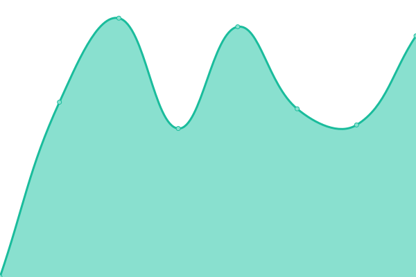

# [📈 Live Status](https://keywordnew.github.io/stockholm-watchtower): <!--live status--> **🟧 Partial outage**

This repository contains the open-source uptime monitor and status page for [Manil Chowdhury](https://manil.xyz), powered by [Upptime](https://github.com/upptime/upptime).

With [Upptime](https://upptime.js.org), you can get your own unlimited and free uptime monitor and status page, powered entirely by a GitHub repository. We use [Issues](https://github.com/keywordnew/stockholm-watchtower/issues) as incident reports, [Actions](https://github.com/keywordnew/stockholm-watchtower/actions) as uptime monitors, and [Pages](https://keywordnew.github.io/stockholm-watchtower) for the status page.

<!--start: status pages-->
<!-- This summary is generated by Upptime (https://github.com/upptime/upptime) -->
<!-- Do not edit this manually, your changes will be overwritten -->
<!-- prettier-ignore -->
| URL | Status | History | Response Time | Uptime |
| --- | ------ | ------- | ------------- | ------ |
|  [Stockholm Vatten och Avfall](https://www.stockholmvattenochavfall.se/) | 🟩 Up | [stockholm-vatten-och-avfall.yml](https://github.com/keywordnew/stockholm-watchtower/commits/HEAD/history/stockholm-vatten-och-avfall.yml) | 

 2286ms
     
 | 

<a href="https://keywordnew.github.io/stockholm-watchtower/history/stockholm-vatten-och-avfall">100.00%</a>
    

|  [E.ON SE](https://www.eon.se/) | 🟥 Down | [e-on-se.yml](https://github.com/keywordnew/stockholm-watchtower/commits/HEAD/history/e-on-se.yml) | 

 128ms
     
 | 

<a href="https://keywordnew.github.io/stockholm-watchtower/history/e-on-se">0.00%</a>
    

|  [Telia Sverige AB](https://www.telia.se/privat/mitt-telia) | 🟩 Up | [telia-sverige-ab.yml](https://github.com/keywordnew/stockholm-watchtower/commits/HEAD/history/telia-sverige-ab.yml) | 

 2235ms
     
 | 

<a href="https://keywordnew.github.io/stockholm-watchtower/history/telia-sverige-ab">100.00%</a>
    

|  [Karolinska Institutet](https://www.karolinska.se/) | 🟩 Up | [karolinska-institutet.yml](https://github.com/keywordnew/stockholm-watchtower/commits/HEAD/history/karolinska-institutet.yml) | 

 819ms
     
 | 

<a href="https://keywordnew.github.io/stockholm-watchtower/history/karolinska-institutet">100.00%</a>
    

|  [Polismyndigheten](https://polisen.se/utsatt-for-brott/polisanmalan/) | 🟩 Up | [polismyndigheten.yml](https://github.com/keywordnew/stockholm-watchtower/commits/HEAD/history/polismyndigheten.yml) | 

 922ms
     
 | 

<a href="https://keywordnew.github.io/stockholm-watchtower/history/polismyndigheten">100.00%</a>
    

|  [Storstockholms Lokaltrafik](https://sl.se/privat/min-profil) | 🟩 Up | [storstockholms-lokaltrafik.yml](https://github.com/keywordnew/stockholm-watchtower/commits/HEAD/history/storstockholms-lokaltrafik.yml) | 

 898ms
     
 | 

<a href="https://keywordnew.github.io/stockholm-watchtower/history/storstockholms-lokaltrafik">100.00%</a>
    

|  [Skandinaviska Enskilda Banken AB](https://seb.se/) | 🟩 Up | [skandinaviska-enskilda-banken-ab.yml](https://github.com/keywordnew/stockholm-watchtower/commits/HEAD/history/skandinaviska-enskilda-banken-ab.yml) | 

 614ms
     
 | 

<a href="https://keywordnew.github.io/stockholm-watchtower/history/skandinaviska-enskilda-banken-ab">100.00%</a>
    

<!--end: status pages-->

[**Visit our status website →**](https://keywordnew.github.io/stockholm-watchtower)

## 📄 License

- Powered by: [Upptime](https://github.com/upptime/upptime)
- Code: [MIT](./LICENSE) © [Manil Chowdhury](https://manil.xyz)
- Data in the `./history` directory: [Open Database License](https://opendatacommons.org/licenses/odbl/1-0/)
